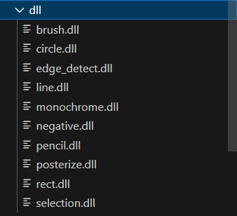
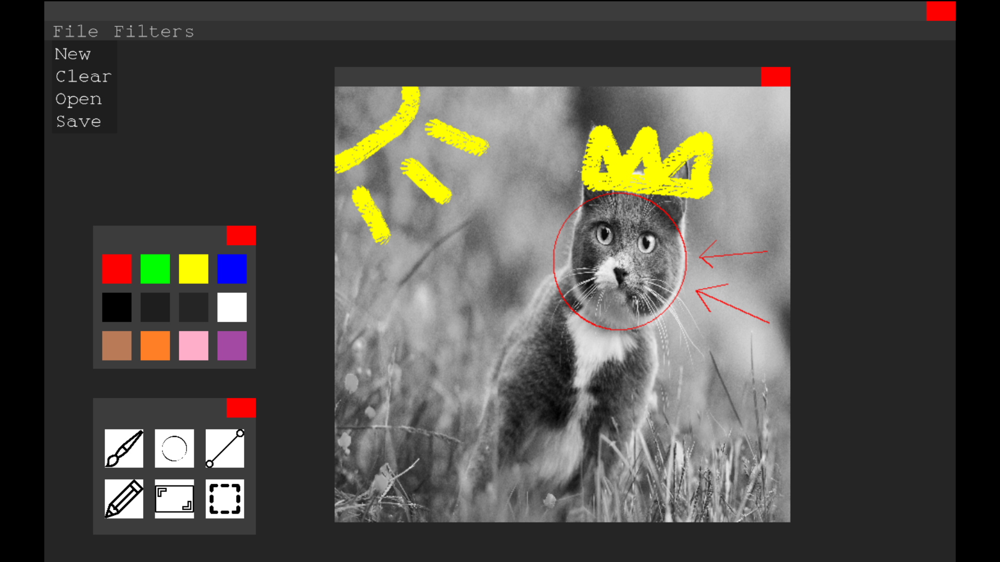
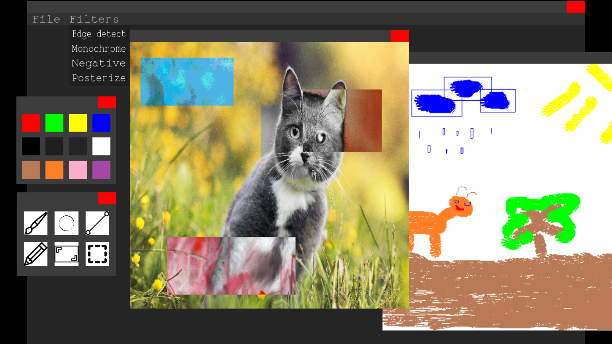

# Photoshop
An image editing application with custom tools and filters

## Features
- **Save/load images**: Multiple formats supported
- **Multi-document editing**: Work on multiple images simultaneously
- **Custom widget system**: The UI framework built using design patterns
- **Dynamic plugins**: Loading tools and filters from DLLs at runtime

## Design patterns used
It was nice to practice using design patters in this project.
The ones implemented include:
- **Decorator** (WindowFrame, WidgetHider)
- **Observer** (CanvasFocusManager)
- **Command** (Actions for buttons)
- **Facade** (WidgetContainer)
- **Iterator** (WidgetContainer)

## Screenshots
### Basic usage
---

### Mutli-file editing
---
